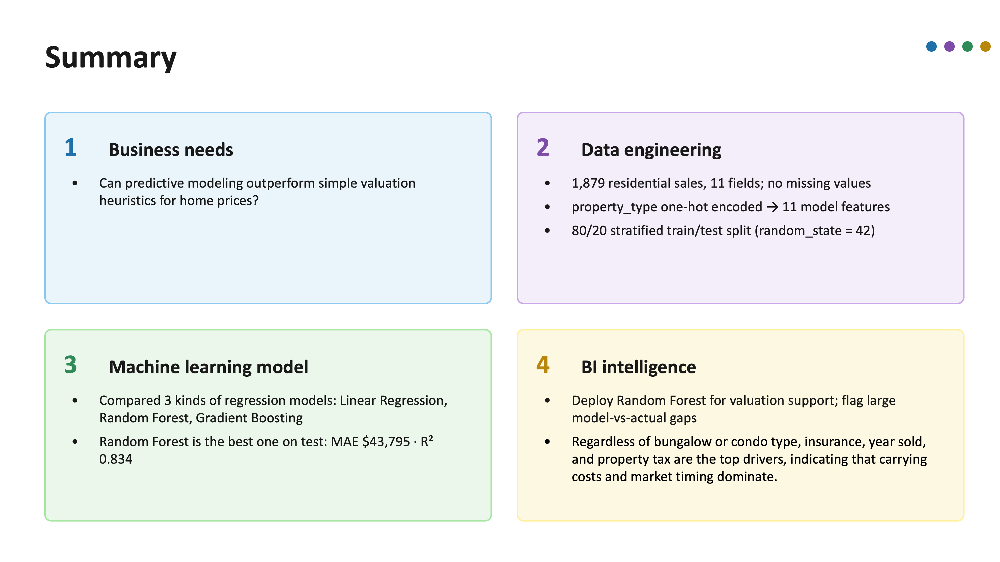

# Real Estate Price Prediction

**Predictive Modeling Versus Valuation Heuristics: A Comparative Machine-Learning Study of Residential Real-Estate Price Prediction**

DongHwan Won | Dylan H. Won — 06 Aug 2026

## Summary

## Business Question
Can predictive price modeling outperform simple valuation heuristics for home prices? 

Practitioners commonly rely on two heuristics: (a) the market-average price per square foot multiplied by the listing's area, and (b) the mean sale price of comparable property types. Both are transparent but ignore interactions among quality, carrying costs, and market timing, producing systematic over- and under-pricing.

## Business Ingelligence:streamlit site
https://real-estate-price-prediction-3vwfamn7znyrwkrcghkmbh.streamlit.app

## Results
**Model Performance on the Held-Out Test Set**

| Model | Train MAE ($) | Test MAE ($) | Test RMSE ($) | Test R² |
|---|---|---|---|---|
| Linear Regression | 91,017 | 92,220 | 116,262 | 0.459 |
| **Random Forest** | 17,619 | **43,795** | 64,424 | **0.834** |
| Gradient Boosting | 33,336 | 44,611 | 65,024 | 0.831 |

## Conclusion

On 1,879 residential transactions, ensemble machine learning decisively outperforms both a linear baseline and, by construction, the simple heuristics it emulates: the deployed Random Forest predicts sale price within **$43,795** on average (R² = 0.834). The analysis yields a clear, actionable insight — anchor pricing guidelines on carrying costs and sale timing rather than size alone, and flag listings with large model-versus-actual gaps for review. Future work should incorporate location features, inflation-adjusted prices, and periodic retraining.

#### References
[1] R. A. Dubin, “Predicting house prices using multiple listings data,” J. Real Estate Finance Econ., vol. 17, no. 1, pp. 35–59, 1998.
[2] C. Shearer, “The CRISP-DM model: The new blueprint for data mining,” J. Data Warehousing, vol. 5, no. 4, pp. 13–22, 2000.
[3] L. Breiman, “Random forests,” Machine Learning, vol. 45, no. 1, pp. 5–32, 2001.
[4] J. H. Friedman, “Greedy function approximation: A gradient boosting machine,” Ann. Statist., vol. 29, no. 5, pp. 1189–1232, 2001.
[5] F. Pedregosa et al., “Scikit-learn: Machine learning in Python,” J. Mach. Learn. Res., vol. 12, pp. 2825–2830, 2011.

#### tree 
.

├── data
│   └── cleaned_df.csv
├── ppt
│   └── Real_Estate_Price_Prediction.mp4
├── python
│   ├── real_estate_analysis.py
│   ├── stage0.py
│   ├── stage2.py
│   ├── stage3.py
│   └── stage4.py
├── README.md
├── report
│   └── real estate report.pdf
├── results
│   ├── csv
│   │   ├── encoded_data.csv
│   │   └── test_predictions.csv
│   ├── RE_GradientBoostingRegressor_Model.pkl
│   ├── RE_LinearRegression_Model.pkl
│   ├── RE_RandomForestRegressor_Model.pkl
│   ├── txt
│   │   └── real_estate_report.txt
│   └── visual
│       ├── actual_vs_predicted.png
│       ├── EDA_heatmap.png
│       ├── EDA_target_histogram.png
│       ├── feature_importance.png
│       ├── mae_comparison.png
│       └── model_comparison.png
├── slide
│   └── summary.png
└── streamlit_app.py

